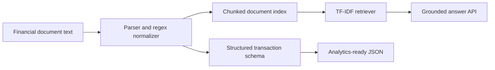

# TradeDoc AI: Financial Document Intelligence RAG Platform

TradeDoc AI is a portfolio-ready reference implementation for financial document intelligence. It extracts structured transaction fields, creates a searchable document index, and answers questions with source snippets.

## Why this project exists

This project demonstrates the core skills used in enterprise GenAI document workflows:

- Document parsing and preprocessing
- Financial entity extraction with structured outputs
- Retrieval-augmented question answering
- API-based integration using FastAPI
- Testable, container-ready Python application design

## Architecture



## Quick Start

```bash
python -m venv .venv
source .venv/bin/activate
pip install -r requirements.txt
uvicorn tradedoc_ai.app:app --reload --app-dir src
```

Open `http://127.0.0.1:8000/docs`.

## Example API Calls

```bash
curl -X POST http://127.0.0.1:8000/extract \
  -H "Content-Type: application/json" \
  -d '{"document_text":"Account 7890\nTransaction 2026-01-02 ACH CREDIT Payroll $2450.50\nTransaction 2026-01-03 CARD DEBIT Grocery -$82.10\nEnding balance $9368.44"}'
```

```bash
curl -X POST http://127.0.0.1:8000/ask \
  -H "Content-Type: application/json" \
  -d '{"document_text":"Account 7890\nTransaction 2026-01-02 ACH CREDIT Payroll $2450.50\nEnding balance $9368.44","question":"What was the ending balance?"}'
```


